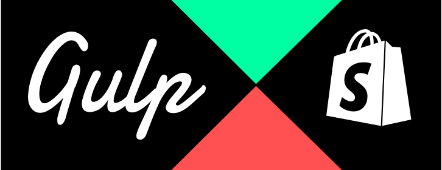

[](https://www.npmjs.com/package/gulp-shopify-theme)

# Gulp Shopify Theme

Shopify theme development support for Gulp.js. Asynchronous theme assets uploads, retry-on-error.

## Install

```shell
$ npm install --save-dev gulp-shopify-theme
```

## Features

## Usage	

A full working example can be found here: [gist.github.com/tmslnz/1d025baaa…](https://gist.github.com/tmslnz/1d025baaa7557a2d994032aa88fb61b3)

```js
var shopifyTheme = require('gulp-shopify-theme').create();
var shopifyConfig = {
    "api_key": "8a1a2001d06ff…",
    "password": "51f8c8de49ee28…",
    "shared_secret": "51f8c8de49ee51…",
    "shop_name": "yourshopname…",
    "theme_id": "12345678…"
}

gulp.task( 'copy', ['shopify-theme-init'], function () {
    return gulp.src( [ 'src/{layout,config,snippets,templates,locales}/**/*.*' ] )
        .pipe( shopifytheme.sync() );
});

gulp.task( 'shopify-theme-init', function () {
    shopifyTheme.init(shopifyConfig);
});
```

